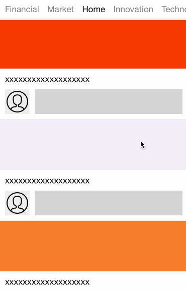

PageController [](https://github.com/Carthage/Carthage) [](https://travis-ci.org/hirohisa/PageController)
==================

PageController is infinite paging controller, scrolling through contents and title bar scrolls with a delay. Then it provide user interaction to smoothly and effortlessly moving. It is for iOS written in Swift.



Requirements
----------
- iOS 8.0+

Features
----------

- [x] To inherit from [DCScrollView](https://github.com/hirohisa/DCScrollView)
- [x] Use `UIViewController`, not `UIView` like `UITabBarController`
- [x] Scrolling smoothly and effortlessly
- [x] Support AutoLayout about MenuCell
- [x] Handling to change current view controller with Delegate.

Installation
----------

### CocoaPods

[CocoaPods](http://cocoapods.org) is a dependency manager for Cocoa projects.

To integrate PageController into your Xcode project using CocoaPods, specify it in your `Podfile`:

```ruby
source 'https://github.com/CocoaPods/Specs.git'
platform :ios, '8.0'
use_frameworks!

pod 'PageController'
```

Then, run the following command:

```bash
$ pod install
```

Usage
----------

**viewControllers**

Type is [UIViewController], and element must have title.

```swift

import PageController

class CustomViewController: PageController {

    override func viewDidLoad() {
        super.viewDidLoad()

        viewControllers = createViewControllers()
    }

    func createViewControllers() -> [UIViewController] {
        var viewControllers = [UIViewController]()

        let names = [
            "favorites",
            "recents",
            "contacts",
            "history",
            "more",
        ]

        for name in names {
            let viewController = UIViewController()
            viewController.title = name
            viewControllers.append(viewController)
        }

        return viewControllers
    }
}

```

**MenuBar**

Enable to change backgroundColor, frame and MenuCell.

```swift
menuBar.backgroundColor = UIColor.whiteColor().colorWithAlphaComponent(0.9)
menuBar.registerClass(CustomMenuCell.self)
```

**MenuCell**

- constentInset

Margins between cells are zero, because it is difficult that calculating distance of scrolling.
If you change margins between cell's labels or vertical position, use constentInset.

- updateData()

If property cell's selected is changed, `updateData()` is called. You customize animations of activate to dis-activate, or dis-activate to activate, implement as override `updateData()`.


## License

PageController is available under the MIT license.
